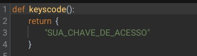
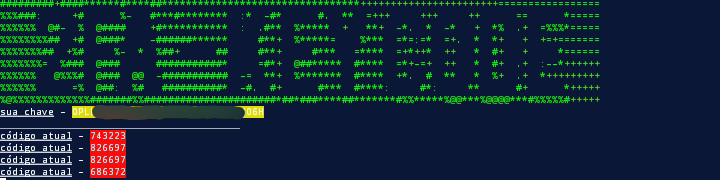

# SCRIPT DE AUTENTICAÇÃO DE 2 FATORES (2FA)

_Este script depende apenas que você configure o arquivo **keys.py**, e execute utilizando o arquivo **python3 2fa-Code.py**_
_____________________________________________
**instalação**
_e necessário você ter as seguintes bibliotecas instaladas_
pyopt 
- **caso não a tenha instalada utilize o seguinte comando**

__pip install pyopt__

após estar tudo pronto você pode executar script com o comando principal, lembrando que você antes deve modificar o arquivo **keys.py** inserindo nele a Key de 2fa que o aplicativo forneceu a você.

**abaixo uma imagem ilustrativa do campo aonde você irá colocar a sua chave Key no arquivo _keys.py_**

_____________________________________________
**abaixo uma imagem ilustrativa do script em funcionamento**

# Desenvolvedor 
_@LorranC.S._
[acesso](https://github.com/lorrandesenvolvedor/Automa-es-em-python3-para-hacking/tree/main/2faCode)
