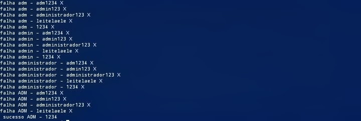

# INFORMAÇÕES SOBRE O CÓDIGO 

_o código e um exemplo de automação de bruteforce, confirmando com variável.text, a qual e uma verificação falha na maioria dos serviços atuais, mesmo sendo apenas um exemplo eu não me responsabilizo por qualquer mal uso, pois o programa e apenas educativo com intuito de mostrar o poder do Python na área da automação e da ciber segurança._
# sobre os arquivos 
este projeto utiliza-se de 3 arquivos, sendo o arquivo **password.txt** o responsável por carregar as senhas, o arquivo **usuarios.py** o responsável por armazena a lista de usuários que voce deseja editar, e por fim o arquivo princal **brutetext.py** repensavel pela requisição e leitura dos outros arquivos, ele também e responsável por você adicionar a url do site que será alvo e os parâmetros necessários do site para que a automação consiga enviar os dados.
# BIBLIOTECA UTILIZADA
_neste código foi utilozado a biblioteca **requests**_
# Como executar 
instale as seguintes dependências
**pip install requests**
logo apos você ja ter editado todas as informações necessárias para o atack no arquivo basta ir ate o diretório e digitar o seguinte comando 
**python3 funcao.py**
_Qualquer erro se ouver, você tera que confirmar se as informações do alvo estão corretas no arquivo para realizar o teste, e também se as dependências e os comandos funcionam normalmente em seu sistema operacional e estão instalandas_
# Desenvolvedor 
_@Lorran C. S._
# código 
[clique aqui](https://github.com/lorrandesenvolvedor/Automa-es-em-python3-para-hacking/tree/main/Bruteforce/BruteText)
