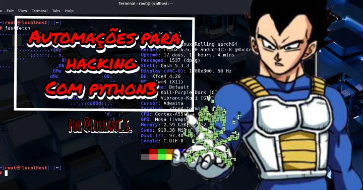

# Automa-es-em-python3-para-hacking

Este repositório contém exemplos de automações em python3 que podem ser úteis na ciber segurança. Nada doque está aqui e utilizado de modo anti ético, pois estou apenas compartilhando exemplos de automações que podem ser utilizadas com python3 (versão atual que estou criando as autorizações) para hacking.

# Desenvovedor
_Lorran C. S._

**Informações finais**
*este repositório foi criado cok intuito de apresentar ideias e modelos de ferramentas para ciber segurança, indo a diversas areas como **pentest** **osint** **web** e outras...*

**Acesso**
[clique aqui](https)
