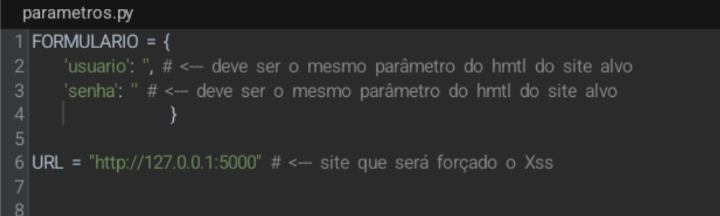
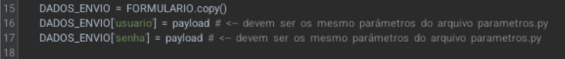
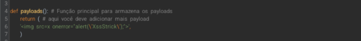

# Automaçoes em python3 para hacking.

Este repositório contém exemplo de uma automação que insere Scripts buscando que o alvo (site) retorne oque foi inserido. Você pode modificar, estilizar, e evoluir o script. E um código simples que pode ser falho.

# Desenvolvedor
_Lorran C. S._

# *Informações*
**Modifique aqui**

o arquivo **parametros.py** contém as variáveis necessárias para o script identificar o alvo, e aonde ele irá injetar os payloads para retorno. você pode acrescentar mais campos, e remover campos, isso vai do alvo.
_______________________________________
**Modifique aqui**

no arquivo principal **xssStrick.py** você deve editar esses campos e deixalos com os mesmos dados que você adicionou em **parametros.py** isso funciona como uma memória, e a função responsável por indicar ao script aonde deve injetar os payloads.
_______________________________________
**Modifique aqui**

Ainda no arquivo principal **xssStrick.py** você deve adicionar nessa tupla os payloads que deseja que o script executa no alvo, o script irá ler tudo o que for refletido, pois tudo que e refletido imprime no código e o script verifica se oque foi enviado retornou no código. *Avisso!!* -> __Nem tudo que retorna no código quer dizer que realmente foi refletido ou interpretado, isso deixa o script falho pois por vários fatores o site pode por exemplo imprimir o payload sem executar e o script irá entender como refletido. Esse fator torna o código falho, além disso cuidado com aspas nos payloads, pois pode quebrar a variável !__

# Acesso
[clique aqui para acessar o diretorio completo](https://link diretório)

